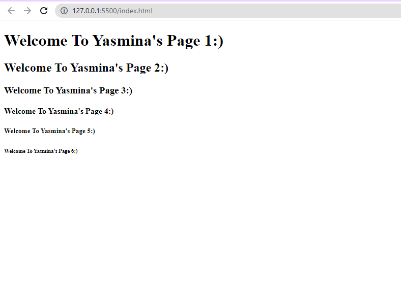

# iti Cms Track Js
This project is about making a function that write "welcome to Yasmina's page" 6 times using h1 t0 h6 header sizes.
# Demo Preview

# Table of contents
- [Project Title](#iti-cms-track-js)
- [Demo Preview](#demo-preview)
- [Table of contents](#table-of-contents)
- [Contribute](#contribute)
# Contribute
Only ITI reviewers are allowed to clone, fork, and pull my project